# Guess-The-Artist
## To identify the artist analysing new pictures

**Author** : SHAILESH DHAMA

Predicting the artists by their paintings is a tedious task,provided the knowledge of it. To make machine learn to predict/guess the artists is a challenging task.
The dataset required a collection of artworks of the 50 most influential artists of all time with basic information retrieved from wikipedia. 
I tried to create a convolutional neural network to recognise the artists looking the colors used and the geometric patterns inside the pictures.

## Objective:

Develop an algorithm which will identify the artist when provided with a painting, with state of the art precision.

### Dataset:

This dataset contains three files:

artists.csv: dataset of information for each artist
images.zip: collection of images (full size), divided in folders and sequentially numbered
resized.zip: same collection but images have been resized and extracted from folder structure
    
## Approach:

1.Data processing:

                There are paintings of 50 artists in the dataset. However only 11 artists have more than 200 paintings available here.

                To reduce computation and better training, I decided to use the paintings of these 11 artists only.

                Since this is an imbalanced datset (Van Gogh has 877 paintings whereas Marc Chagall has only 239), class_weight is important. Infact, it improved model   performance substantially.

                I used Keras ImageDataGenerator for data augmentation. This is not a traditional object detection problem, hence the augmentation approch should be used very carefully.

2.Modelling and Training:

                Use Convolutional Neural Network based approach, with a pre-defined architecture as baseline.

                I tried multiple architectures, however ResNet50 worked well so far.

                Pretrained weights on imagenet helped the model train better.

                The objective is to identify artist and not objects in the images. So the model should understand the style of the image better rather than the final output. Hence, training of shallow layers is more important than the deeper layers.

                The above statement is based on my understanding of the problem and experiments and observations.

                Training the model for more iterations might improve the performance, at the cost of computation resource.

3.Predictions:

                The final model could identify the artists with an approximate accuracy of 99% on training set and 85% on cross-validation set.
           
## RESULTS :

#### Dataset Content


#### Random Paintings in dataset
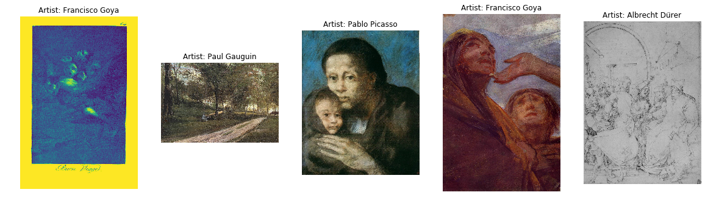

#### Paintings Nationwise
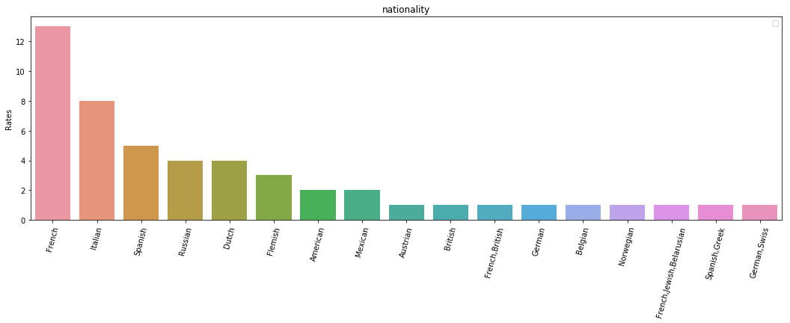

#### Art Genres
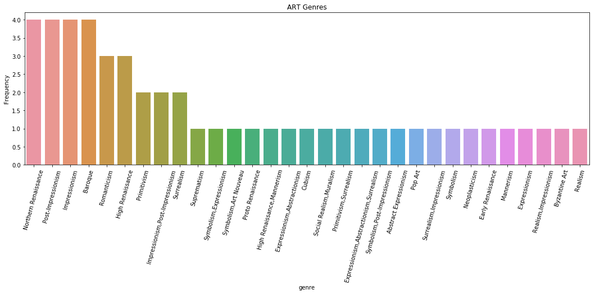

#### Genres based on Age_group of Artists
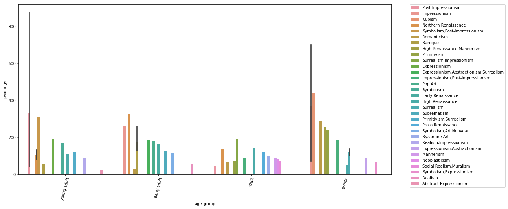

#### Age-Group Analysis
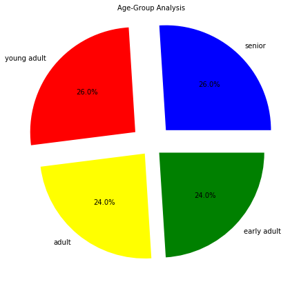


#### Violin Paintings
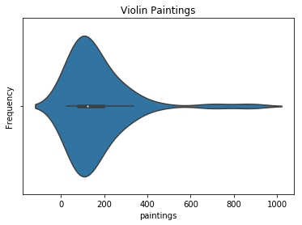

#### Genres based on Nationality
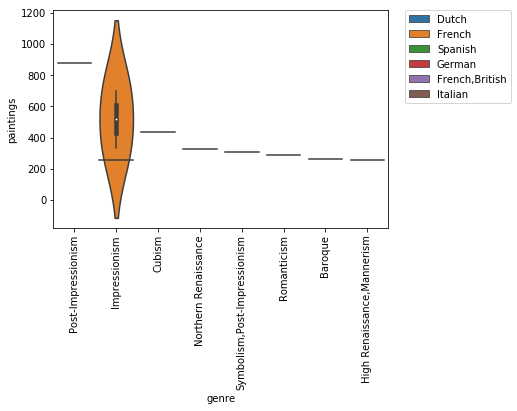

#### Genres based on Languages
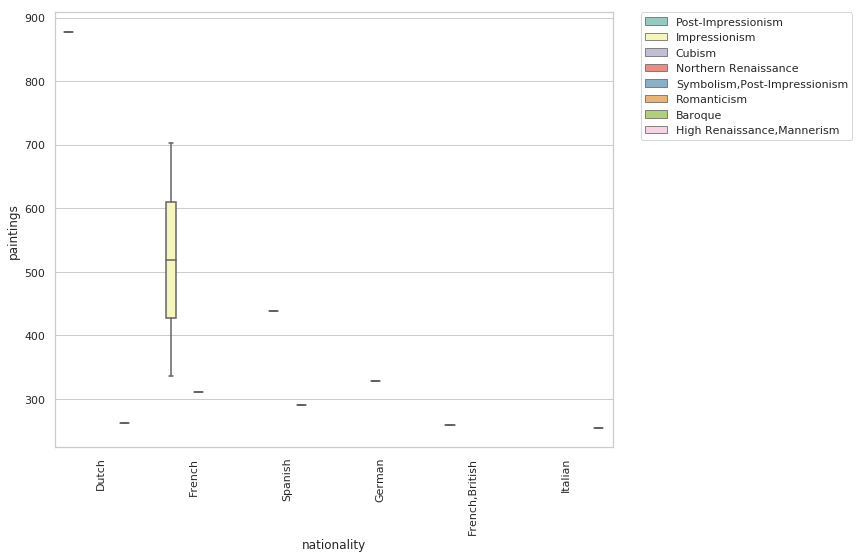

#### Factorplots
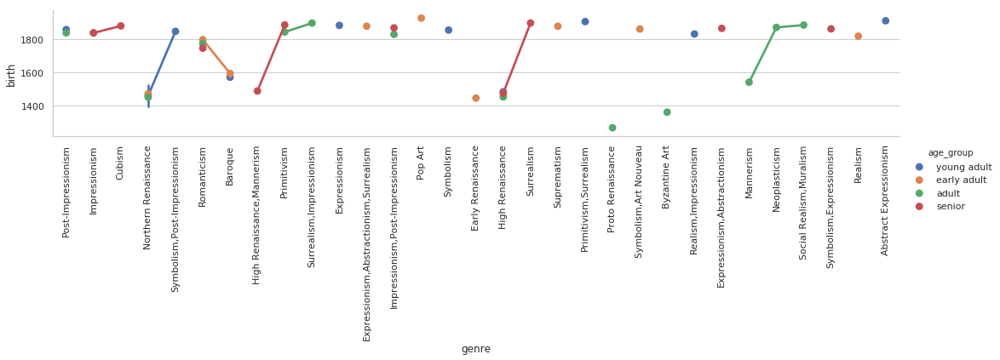
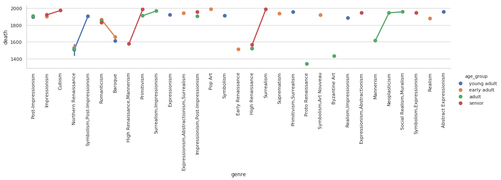
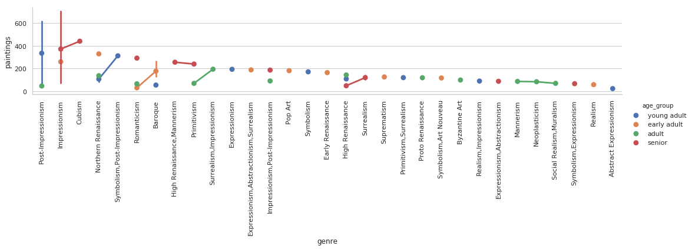

#### Training and Validation Metrics
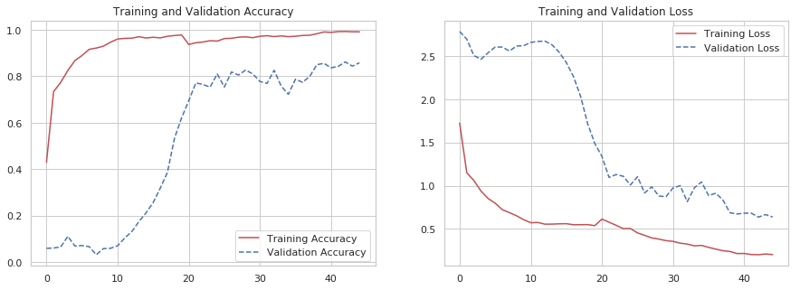

#### Confusion Matrix
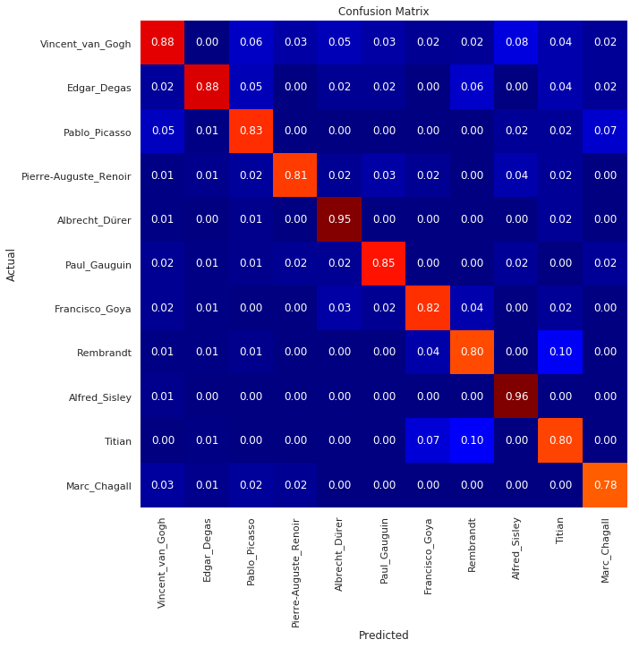

#### Prediction Output
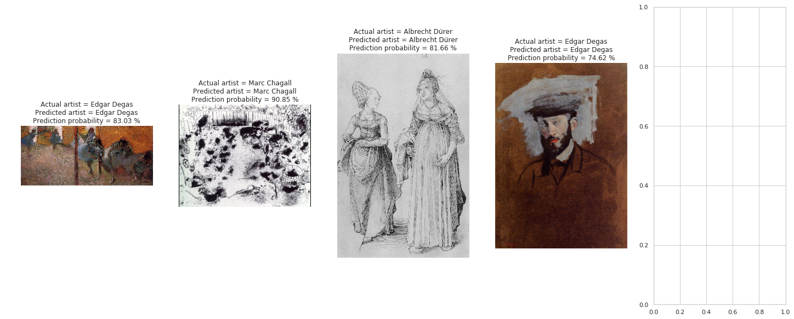

### For further information:

Please review the narrative of our analysis in [our jupyter notebook](./Guess-The-Artist.ipynb)

For any additional questions, please contact **shaileshettyd@gmail.com)

##### Repository Structure:

```

├── README.md                                               <- The top-level README for reviewers of this project.
├── Guess-The-Artist.ipynb                                  <- narrative documentation of analysis in jupyter notebook
├── artists.csv                                             <- Dataset
└── images                                                  <- generated from code

```
## Citing :

```
@misc{Shailesh:2020,
  Author = {Shailesh Dhama},
  Title = {Guess-The-Artist},
  Year = {2020},
  Publisher = {GitHub},
  Journal = {GitHub repository},
  Howpublished = {\url{https://github.com/ShaileshDhama/Guess-The-Artist}}
}
```
